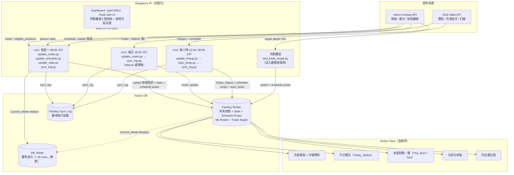

# Fantasy Baseball × Notion 自動化架構規劃

## 系統架構



---

## DB 設計

### DB1：Fantasy Roster（所有球員）

自己的陣容 + 潛力交易目標統一放這裡，用 `Player_Type` 區分

更新時機：每週一自動 + 新增交易目標時手動觸發

| Property | 類型 | 說明 |
|----------|------|------|
| Name | Title | 球員姓名 |
| MLB_Team | Select | 所屬 MLB 球隊（TOR / LAD…） |
| Player_Type | Select | `My Roster` / `Trade Target` |
| Fantasy_Team | Text | 目前在哪支 Fantasy 隊（My Roster 留空） |
| Current_Slot | Select | Fantasy 位置（C/1B/2B/3B/SS/OF/Util/BN/IL），Trade Target 留空 |
| Eligible_Positions | Multi-select | 可守位置（C/1B/2B/3B/SS/OF/Util） |
| Position_Type | Select | B（打者）/ P（投手） |
| Status | Select | Healthy / DTD / IL |
| Notes | Text | 交易筆記、分析備忘 |
| Player_ID | Number | Yahoo player_id（upsert key） |
| Stats_Updated_At | Date | stats 最後更新時間 |
| Today_Status | Select | 今日打線狀態：IN / OUT / TBD / OFF / START；由 update_lineup.py 每小時更新，swap_logic 讀此欄做換人判斷 |
| **打者 Stats** | | |
| AVG_7d / AVG_30d / AVG_season | Number | 打擊率（三區間） |
| HR_7d / HR_30d / HR_season | Number | 全壘打 |
| RBI_7d / RBI_30d / RBI_season | Number | 打點 |
| R_7d / R_30d / R_season | Number | 得分 |
| SB_7d / SB_30d / SB_season | Number | 盜壘 |
| HPI_7d / HPI_30d / HPI_season | Formula | Hitter Power Index = R + RBI + HR×2 + SB×2 + (AVG−0.250)×1000；打者綜合強度指標（投手行為空值回傳 0） |
| **投手 Stats** | | |
| W_7d / W_30d / W_season | Number | 勝投 |
| SV_7d / SV_30d / SV_season | Number | 救援 |
| K_7d / K_30d / K_season | Number | 三振 |
| ERA_7d / ERA_30d / ERA_season | Number | 防禦率 |
| WHIP_7d / WHIP_30d / WHIP_season | Number | WHIP |
| **Schedule Props（Step 4.z 新增）** | | |
| Current_Week | Relation → DB_Week | 目前所在週 |
| This_Mon ～ This_Sun | Text（rich_text） | 本週每日賽況；野手：`vs NYY / Gausman`；投手確認先發：**`vs NYY`**（bold）；OFF 留空 |
| Next_Mon ～ Next_Sun | Text（rich_text） | 下週每日賽況（同上格式） |

---

### DB_Week（整季週次，靜態）

一次性建立，整季不動。僅供 DB1 的 `Current_Week` Relation 使用。

`setup_db_week.py` 執行後自動建立（DB ID 寫入 notion_config.py）。

| Property | 類型 | 說明 |
|----------|------|------|
| Week_Number | Title | `W01`、`W02`…（upsert key） |
| Week_Start | Date | 該週週一日期（ET 基準） |

---

### ~~DB2：Fantasy Schedule（已 archive）~~

原為每日賽況（每球員 × 7天 rows），週一建立 ~210 rows API 呼叫太多。
已整合進 DB1 的 14 個 schedule props，Notion 端已 archive。

### ~~DB3：Fantasy Stats（已 archive）~~

原為區間統計快照（每球員 3 筆），已整合進 DB1 的 `_7d/_30d/_season` props，Notion 端已 archive。

---

## 腳本規劃

| 腳本 | 觸發 | 說明 |
|------|------|------|
| `update_roster.py` | 每週一 / 手動 | 從 Yahoo API 拉自己陣容，upsert DB1；upsert 後自動比對 Notion My Roster，archive 已離隊球員 |
| `update_schedule.py` | 每週一 | PATCH DB1 所有球員的 This_Mon～Next_Sun 14 個 schedule props + Current_Week relation；支援 --dry-run |
| `update_stats.py` | 每週一 | 從 Yahoo API 拉數據，patch DB1 stats 欄位（_7d/_30d/_season） |
| `update_lineup.py` | 每小時 22–08 JST | Yahoo API 同步 DB1 Current_Slot + MLB API 更新 DB1 Today_Status + schedule props（opposing SP 即時） |
| `add_trade_target.py` | 手動（Dashboard 或 CLI） | 輸入球員姓名或 Yahoo ID → 查 Yahoo API → upsert DB1 + PATCH DB1 兩週 schedule props + patch stats + Ros%；結果寫入 sync.log |
| `setup_db_week.py` | 手動（一次性） | 建立 DB_Week Notion DB + 寫入整季 26 週次 + DB1 新增 14 個 schedule props + Current_Week relation |
| `yahoo_playwright.py` | 手動（首次 / session 過期） | Yahoo 瀏覽器登入，session 存 yahoo_session.json |
| `setup_default_slot.py` | 手動（一次性） | DB1 Default_Slot 從 Current_Slot 初始化 |
| `swap_logic.py` | 被 auto_swap.py import | 四階段換人邏輯（Rebalance / Restore / Replace / Chain Swap） |
| `auto_swap.py` | 每小時 22–08 JST（update_lineup 之後） | Playwright 執行換人，支援 --dry-run，fallback locked_pids，結果寫 sync.log |
| `sync_log.py` | 每小時 / 週一全量末尾 | sync.log → DB4 Fantasy Sync Log；cursor 機制（sync.log.cursor）只送新增行，429 自動 retry |

---

## Notion View 規劃

| View 名稱 | DB | 類型 | Filter / Sort |
|-----------|-----|------|---------------|
| 先發陣容 | DB1 | Table | Player_Type = My Roster，Current_Slot ≠ BN/IL |
| 板凳＋彈性 | DB1 | Table | Player_Type = My Roster，Current_Slot = BN |
| 傷兵追蹤 | DB1 | Table | Status ≠ Healthy |
| 今日賽況 | DB1 | Table | Player_Type = My Roster，顯示 Today_Status + This_Mon～Sun |
| 本週對戰 | DB1 | Table | 顯示 This_Mon～This_Sun，sort by Current_Slot |
| 交易分析板 | DB1 | Table | Player_Type = Trade Target，顯示 Eligible_Positions + Notes + Stats |
| 同位置比較 | DB1 | Table | filter by Eligible_Positions，My Roster vs Trade Target 並列 |

---

## Cron 排程（RPi）

```
# 每週一 9:00 JST = 0:00 UTC（全量更新）
0 0 * * 1  cd ~/fantasy-baseball && source venv/bin/activate && python sync/update_roster.py && python sync/update_schedule.py && python sync/update_stats.py ; python sync/sync_log.py

# 每日 18:30 JST = 9:30 UTC（Waiver 結果後同步陣容）
30 9 * * *  cd ~/fantasy-baseball && venv/bin/python3 sync/update_roster.py > /dev/null 2>&1; venv/bin/python3 sync/sync_log.py > /dev/null 2>&1

# 每小時（22:00–08:00 JST = 13:00–23:00 UTC）打線更新 + 自動換人
0 13-23 * * *  cd ~/fantasy-baseball && source venv/bin/activate && python sync/update_lineup.py ; python sync/auto_swap.py ; python sync/sync_log.py
```

---

## Notion 設定

| 項目 | 值 |
|------|-----|
| Workspace | 新 Workspace（第二個） |
| API Key | `~/.config/notion/api_key_new` |
| Parent page | `34048ad3-2a1c-80a0-bcaa-ca973c2d4100` |
| Fantasy Roster | `1eb4bb64-da35-4e9d-b740-f36c8569d3a6` |
| Fantasy Schedule（已 archive） | `4bf3af3c-7095-493a-8746-5ad0fc9f147f` |
| Fantasy Stats（已 archive） | `d3de639b-94af-44e3-9795-9ac965bb5419` |
| DB_Week | `34648ad3-2a1c-8135-9968-c5830f8f99a9` |
| Fantasy Sync Log | `34148ad3-2a1c-8141-ace0-df0667ecc04d` |

詳細設定見 `notion_config.py`。

---

---

## 陣容自動換人（Playwright）

Yahoo Fantasy API 不開放 Write scope 給一般開發者，陣容寫入改走 Playwright 瀏覽器自動化。

### 架構

```
update_lineup.py（每小時）
  → 更新 DB1 Today_Status（IN/OUT/TBD/OFF/START）
  → 更新 DB1 Current_Slot（從 Yahoo API 同步）

auto_swap.py（update_lineup 之後手動或 cron）
  ├── swap_logic.py：三階段換人邏輯
  │     Phase 0 — Rebalance（先發格對調）
  │       - 找出互換錯位的兩人（都在先發格但守著對方的 Default_Slot）
  │       - 直接對調，不經過 BN
  │     Phase 1 — Restore（從 BN 換回）
  │       - 找出 Default_Slot 在先發格但目前在 BN 且今日 IN/TBD 的球員
  │       - 找佔著該格的 intruder（Default_Slot ≠ 該格），踢去 BN，原主人換回
  │     Phase 2 — Replace（替補）
  │       - 找出 Current_Slot 在先發格且今日 OFF/OUT 的球員
  │       - 從 BN（含 Phase 1 換下的 intruder）找最佳候補補上
  │       - 依 DB1 HPI_7d 評分排名，Util 格接受任意打者
  │       - in=None 代表無可用替補
  │     Phase 2.5 — Chain Swap（連鎖換人）
  │       - BN 找不到直接替補時，從其他先發格找有資格球員移過去
  │       - 空出的先發格再由 BN 補（如 Jackson→2B + PCA→OF 連鎖）
  │       - out_slot 合法性檢查：若移出球員已鎖定（已打完），chain swap 整組跳過
  └── Playwright：執行換人
        - 載入 yahoo_session.json（session cookie）
        - 陣容頁讀取隱藏 SELECT
        - 批次 JS 設值，一次 form submit（支援 out_slot 非 BN）
        - 結果寫入 sync.log
        - 支援 --dry-run 試算模式
```

**DB1 新欄位：Default_Slot**（Select，選項同 Current_Slot）
- 含義：健康狀態下該球員的預設守位，由使用者在 Notion 管理
- 初始化：`sync/setup_default_slot.py`（從 Current_Slot 複製，一次性執行）
- 不會被自動 sync 覆蓋，換人後仍維持原設定

### 投手策略（後續階段）

依本週 H2H 累積數據決定是否保護 ERA / WHIP：
- 若 ERA / WHIP 已大幅領先對手，且 K / W 類別也贏 → 將預定先發投手移至 BN，避免數據惡化
- 判斷依據：當週剩餘天數 + 各類別領先差距

---

## 備註

- DB1 用 `Player_ID` 做 upsert key
- DB3 已整合進 DB1，stats 直接 PATCH DB1 對應球員的 page（Fantasy Stats DB ID 已廢棄）
- Trade Target 的賽程跟自己球員完全相同結構，`add_trade_target.py` 加人後自動補齊本週賽程
- Yahoo token 存在 RPi 本機 `oauth2.json`，`yahoo_oauth` 自動 refresh
- Notion API key 存在 RPi 環境變數或 `.env`

