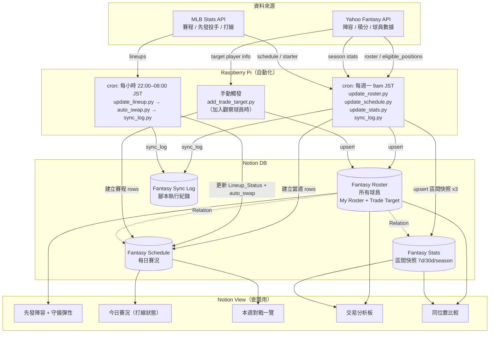

# Fantasy Baseball × Notion 自動化架構規劃

## 系統架構



---

## DB 設計

### DB1：Fantasy Roster（所有球員）

自己的陣容 + 潛力交易目標統一放這裡，用 `Player_Type` 區分

更新時機：每週一自動 + 新增交易目標時手動觸發

| Property | 類型 | 說明 |
|----------|------|------|
| Name | Title | 球員姓名 |
| MLB_Team | Select | 所屬 MLB 球隊（TOR / LAD…） |
| Player_Type | Select | `My Roster` / `Trade Target` |
| Fantasy_Team | Text | 目前在哪支 Fantasy 隊（My Roster 留空） |
| Current_Slot | Select | Fantasy 位置（C/1B/2B/3B/SS/OF/Util/BN/IL），Trade Target 留空 |
| Eligible_Positions | Multi-select | 可守位置（C/1B/2B/3B/SS/OF/Util） |
| Position_Type | Select | B（打者）/ P（投手） |
| Status | Select | Healthy / DTD / IL |
| Notes | Text | 交易筆記、分析備忘 |
| Player_ID | Number | Yahoo player_id（upsert key） |

---

### DB2：Fantasy Schedule（每日賽況）

自己的球員 + Trade Target 都有賽程，方便比較誰這週出賽多

每週一建立當週 7 天資料列，打線狀態每小時更新一次

| Property | 類型 | 說明 |
|----------|------|------|
| Title | Title | `姓名 YYYY-MM-DD`（upsert key） |
| Player | Relation → DB1 | 關聯球員 |
| Player_Type | Formula | 從 DB1 rollup，方便直接 filter |
| Date | Date | 比賽日期（ET 基準） |
| Opponent | Text | 對手球隊（`vs NYY` / `@ BOS`） |
| Opposing_SP | Text | 對手先發投手 |
| Lineup_Status | Select | 打者：`IN` 在打線 / `OUT` 未上場 / `TBD` 未公布 / `OFF` 休息日；投手：`START` 今日先發 / `TBD` 有賽非先發 / `OFF` 休息日 |
| Week | Number | Fantasy 週次 |

---

### DB3：Fantasy Stats（區間快照數據）

每週一更新，每個球員每週存 3 筆（3 個時間窗），用來對比交易目標與自己球員的數據。
累積數據到中後期參考價值低，改用區間快照才能反映當下狀態與趨勢。
注意：Yahoo API 不支援 14d 區間（無 last14days 參數），已省略。

| Property | 類型 | 說明 |
|----------|------|------|
| Title | Title | `姓名 W{週次} {period}`（upsert key，例：`Altuve W15 7d`） |
| Player | Relation → DB1 | 關聯球員 |
| Week | Number | 更新的 Fantasy 週次 |
| Period | Select | `7d` / `30d` / `season` |
| Updated_At | Date | 資料更新時間 |
| **打者** | | |
| AVG | Number | 打擊率 |
| HR | Number | 全壘打 |
| RBI | Number | 打點 |
| R | Number | 得分 |
| SB | Number | 盜壘 |
| **投手** | | |
| W | Number | 勝投 |
| SV | Number | 救援 |
| K | Number | 三振 |
| ERA | Number | 防禦率 |
| WHIP | Number | WHIP |

**Period 使用場景：**
- `7d` → 當下熱度，決定本週誰先發
- `30d` → 過濾短期噪音，看真實水準
- `season` → 全季基準，做最終比較

**Yahoo API 對應：** `stat_type=lastweek` / `lastmonth` / `season`（不支援 14d）

---

## 腳本規劃

| 腳本 | 觸發 | 說明 |
|------|------|------|
| `update_roster.py` | 每週一 / 手動 | 從 Yahoo API 拉自己陣容，upsert DB1；upsert 後自動比對 Notion My Roster，archive 已離隊球員 |
| `update_schedule.py` | 每週一 | 建立 DB1 所有球員的當週 DB2 rows |
| `update_stats.py` | 每週一 | 從 Yahoo API 拉數據，upsert DB3 |
| `update_lineup.py` | 每小時 22–08 JST | Yahoo API 同步 DB1 Current_Slot + MLB API 更新 DB2 今日 Lineup_Status |
| `add_trade_target.py` | 手動 | 輸入球員姓名 → 查 Yahoo API → upsert DB1 + 建立 DB2 本週賽程 |

---

## Notion View 規劃

| View 名稱 | DB | 類型 | Filter / Sort |
|-----------|-----|------|---------------|
| 先發陣容 | DB1 | Table | Player_Type = My Roster，Current_Slot ≠ BN/IL |
| 板凳＋彈性 | DB1 | Table | Player_Type = My Roster，Current_Slot = BN |
| 傷兵追蹤 | DB1 | Table | Status ≠ Healthy |
| 今日賽況 | DB2 | Table | Date = Today，sort by Lineup_Status |
| 本週對戰 | DB2 | Calendar | 本週，by Date |
| 交易分析板 | DB1 | Table | Player_Type = Trade Target，顯示 Eligible_Positions + Notes |
| 同位置比較 | DB3 | Table | filter by Eligible_Positions，My Roster vs Trade Target 並列 |

---

## Cron 排程（RPi）

```
# 每週一 9:00 JST = 0:00 UTC
0 0 * * 1  cd ~/fantasy-baseball && python3 sync/update_roster.py && python3 sync/update_schedule.py && python3 sync/update_stats.py

# 每小時（22:00–08:00 JST = 13:00–23:00 UTC）打線狀態更新
0 13-23 * * *  cd ~/fantasy-baseball && python3 sync/update_lineup.py
```

---

## Notion 設定

| 項目 | 值 |
|------|-----|
| Workspace | 新 Workspace（第二個） |
| API Key | `~/.config/notion/api_key_new` |
| Parent page | `34048ad3-2a1c-80a0-bcaa-ca973c2d4100` |
| Fantasy Roster | `1eb4bb64-da35-4e9d-b740-f36c8569d3a6` |
| Fantasy Schedule | `4bf3af3c-7095-493a-8746-5ad0fc9f147f` |
| Fantasy Stats | `d3de639b-94af-44e3-9795-9ac965bb5419` |
| Fantasy Sync Log | `34148ad3-2a1c-8141-ace0-df0667ecc04d` |

詳細設定見 `notion_config.py`。

---

---

## 陣容自動換人（Playwright）

Yahoo Fantasy API 不開放 Write scope 給一般開發者，陣容寫入改走 Playwright 瀏覽器自動化。

### 架構

```
update_lineup.py（每小時）
  → 更新 DB2 Lineup_Status（IN/OUT/TBD/OFF）
  → 更新 DB1 Current_Slot（從 Yahoo API 同步）

auto_swap.py（update_lineup 之後手動或 cron）
  ├── swap_logic.py：三階段換人邏輯
  │     Phase 0 — Rebalance（先發格對調）
  │       - 找出互換錯位的兩人（都在先發格但守著對方的 Default_Slot）
  │       - 直接對調，不經過 BN
  │     Phase 1 — Restore（從 BN 換回）
  │       - 找出 Default_Slot 在先發格但目前在 BN 且今日 IN/TBD 的球員
  │       - 找佔著該格的 intruder（Default_Slot ≠ 該格），踢去 BN，原主人換回
  │     Phase 2 — Replace（替補）
  │       - 找出 Current_Slot 在先發格且今日 OFF/OUT 的球員
  │       - 從 BN（含 Phase 1 換下的 intruder）找最佳候補補上
  │       - 依 DB3 7d 評分排名，Util 格接受任意打者
  │       - in=None 代表無可用替補
  │     Phase 2.5 — Chain Swap（連鎖換人）
  │       - BN 找不到直接替補時，從其他先發格找有資格球員移過去
  │       - 空出的先發格再由 BN 補（如 Jackson→2B + PCA→OF 連鎖）
  │       - out_slot 合法性檢查：若移出球員已鎖定（已打完），chain swap 整組跳過
  └── Playwright：執行換人
        - 載入 yahoo_session.json（session cookie）
        - 陣容頁讀取隱藏 SELECT
        - 批次 JS 設值，一次 form submit（支援 out_slot 非 BN）
        - 結果寫入 sync.log
        - 支援 --dry-run 試算模式
```

**DB1 新欄位：Default_Slot**（Select，選項同 Current_Slot）
- 含義：健康狀態下該球員的預設守位，由使用者在 Notion 管理
- 初始化：`sync/setup_default_slot.py`（從 Current_Slot 複製，一次性執行）
- 不會被自動 sync 覆蓋，換人後仍維持原設定

### 投手策略（後續階段）

依本週 H2H 累積數據決定是否保護 ERA / WHIP：
- 若 ERA / WHIP 已大幅領先對手，且 K / W 類別也贏 → 將預定先發投手移至 BN，避免數據惡化
- 判斷依據：當週剩餘天數 + 各類別領先差距

---

## 備註

- DB1 用 `Player_ID` 做 upsert key
- DB2 用 `Title`（姓名＋日期）做 upsert key
- DB3 用 `Title`（姓名＋週次＋period，例：`Altuve W15 7d`）做 upsert key
- Trade Target 的賽程跟自己球員完全相同結構，`add_trade_target.py` 加人後自動補齊本週賽程
- Yahoo token 存在 RPi 本機 `oauth2.json`，`yahoo_oauth` 自動 refresh
- Notion API key 存在 RPi 環境變數或 `.env`
